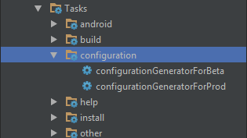

# Gradle Configuration Plugin

This plugin creates configuration class automatically or manually.

## Why should i use this plugin?

We get the configurations from the BuildConfig file by default.
For getting these configs we use this method below :

```groovy
productFlavors {
    beta {
        buildConfigField 'String', 'API_URL', '"http://beta.huseyinozer.me/api/v1/"'
        buildConfigField 'String', 'API_DATE_FORMAT', '"yyyy-mm-dd't'hh:mm:ss"'
        buildConfigField 'String', 'ENVIRONMENT', '""'
    }
    prod {
        buildConfigField 'String', 'API_URL', '"http://prod.huseyinozer.me/api/v1/"'
        buildConfigField 'String', 'API_DATE_FORMAT', '"yyyy-mm-dd't'hh:mm:ss"'
        buildConfigField 'String', 'ENVIRONMENT', '"1200"'
    }
}
```

However, this list can be very long and confusing.
This plugin creates **Configuration.class** from json data automatically.
This json data is more useful.
And this json data file can be grabbed from server or local.

## How it works?

Basically. We need a json data. This json data is;

```json
{
  "default": {
    "apiUrl": "http://huseyinozer.me/api/v1/",
    "apiDateFormat": "yyyy-mm-dd't'hh:mm:ss",
    "environment": "",
    "networkingRequestTimeout": 20000,
    "encodingType": "utf-8"
  },
  "beta": {
    "apiUrl": "http://beta.huseyinozer.me/api/v1/"
  },
  "prod": {
    "apiUrl": "http://prod.huseyinozer.me/api/v1/",
    "environment": "1200",
    "networkingRequestTimeout": 5000
  }
}
```

In this json data, default values are defined first and then keys and values are defined according to flavors.

You have to define flavor to be used in this plugin.

```json
android {
    productFlavors {
        beta {}
        prod {}
    }
}
```

You will get this result (should not be edited) ;

```java
public final class Configuration {
	public static final String API_DATE_FORMAT = "yyyy-mm-dd't'hh:mm:ss";
	public static final String API_URL = "http://beta.huseyinozer.me/api/v1/";
	public static final String ENCODING_TYPE = "utf-8";
	public static final String ENVIRONMENT = "";
	public static final Integer NETWORKING_REQUEST_TIMEOUT = 20000;
}
```

How to use this in code;

```java
Log.d("Log", "API Url: " + Configuration.API_URL);
Log.d("Log", "API DateFormat: " + Configuration.API_DATE_FORMAT);
```

## Setting up this plugin

Build script snippet for use in all Gradle versions:

```groovy
buildscript {
  repositories {
    maven {
      url "https://plugins.gradle.org/m2/"
    }
  }
  dependencies {
    classpath "gradle.plugin.me.huseyinozer.plugins:ConfigurationPlugin:0.1"
  }
}

```

In app build.gradle file:


```groovy
apply plugin: "me.huseyinozer.configuration-plugin"

configurationPlugin {
    configurationUrl = "http://www.mocky.io/v2/58e0ed5c2500004c0063301b"
    autoRun = false
}

```

* **configurationUrl :** Json data on server. If it is not defined, plugin gets the json data from local (This file should be named as "configurations.json").
* **autoRun :** If it is true, plugin works in compile time. But if it is not true, gradle tasks will be generated.

Generated gradle tasks;



## LICENSE

(MIT)
